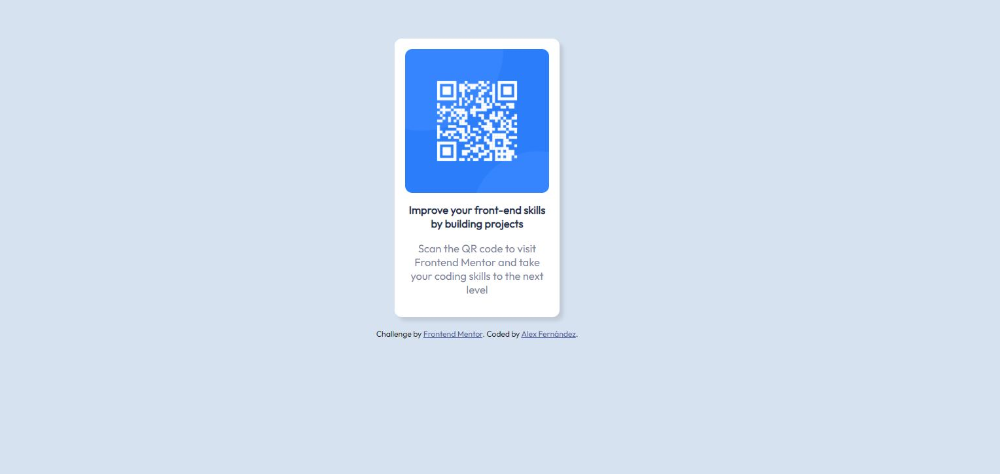
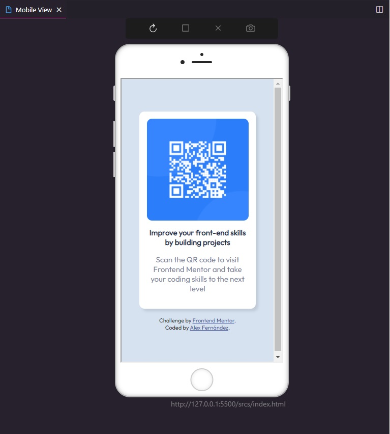

# Frontend Mentor - QR code component solution

This is a solution to the [QR code component challenge on Frontend Mentor](https://www.frontendmentor.io/challenges/qr-code-component-iux_sIO_H). Frontend Mentor challenges help you improve your coding skills by building realistic projects. 

## Table of contents

- [Overview](#overview)
  - [Screenshot](#screenshot)
  - [Links](#links)
- [My process](#my-process)
  - [Built with](#built-with)
  - [What I learned](#what-i-learned)
  - [Continued development](#continued-development)
  - [Useful resources](#useful-resources)
- [Author](#author)
- [Acknowledgments](#acknowledgments)


## Overview

### Screenshot





### Links

- Solution URL: (https://github.com/Arekkusu17/QR-code-component-challenge)
- Live Site URL: (https://arekkusu17.github.io/QR-code-component-challenge/)

## My process

### Built with

- Semantic HTML5 markup
- CSS custom properties
- Flexbox


### What I learned

For me it was very dificult to choose the right properties in css to get the body and the .card to work and be seen as the style guide declared.

At the end, i believe i did a good job with the things that i used.
Always open to any comments


```css
.body {
	background-color: hsl(212, 45%, 89%);
	font-size: 15px;
	font-family: 'Outfit', sans-serif;
	display: flex;
	flex-direction: column;
	align-items: center;
	justify-content: center;
	margin: 4rem;
}

.card {
	background-color: hsl(0, 0%, 100%);
	box-shadow: 5px 5px 5px rgba(0, 0, 0, 0.1);
	border-radius: 0.625rem;
	width: 200px;
	padding: 0.9rem;
	margin-bottom: 1rem;
}

```

### Continued development

I would like to make my own QR Generator so this could be used as a default template.

The qr code could be links to a document or something along those ways. Going to think about something useful that could come in handy.

### Useful resources

- [FLEXBOX FROGGY](https://flexboxfroggy.com/#es) - This helped me to understand better how to use flexbox.


## Author

- Frontend Mentor - [@Arekkusu17](https://www.frontendmentor.io/profile/Arekkusu17)

## Acknowledgments


At some point i was a little stuck with setting the style for the image. And i found this video helpful.

(https://www.youtube.com/watch?v=JFyMWwOxHYM&t=865s)
